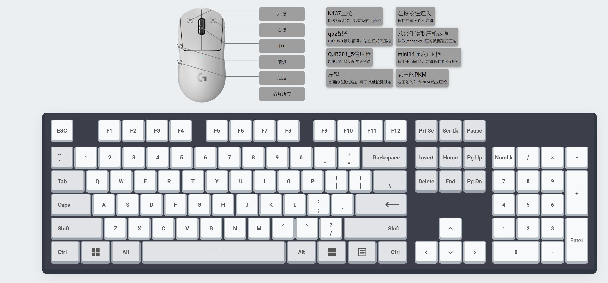

# linx下键鼠转串口键鼠



淘宝买个USB串口转键鼠```KCOM5串口转高速USB键鼠UART/TTL串口转全键盘鼠标免驱双公头模块```

串口端插在linux设备上，比如NAS，或者树莓派，控制端插入要控制设备

运行程序，会自动扫描已接入linux设备的的键鼠（支持热插拔），然后将输出发送控制端设备，在程序中提供了完整的控制接口，可以任意改键编程。

可以在[macro_ctrl.go](macro_ctrl.go)部分添加宏，宏函数接收管道作为参数，按键按下时候使用协程执行此函数，按键松开时会向管道写入
```golang
macros["btn_left"] = macro{
    name:        "左键",
    description: "普通的左键功能，用于其他按键映射",
    fn: func(mk *macroMouseKeyboard, ch chan bool) {
        mk.ctrl.MouseBtnDown(MOUSE_BTN_LEFT)
        <-ch // 等待信号停止
        mk.ctrl.MouseBtnUp(MOUSE_BTN_LEFT)
    },
}
```


通过9264端口可以访问http后台

# 编译运行
```shell
cd server
yarn build
cd ..
go build
```
